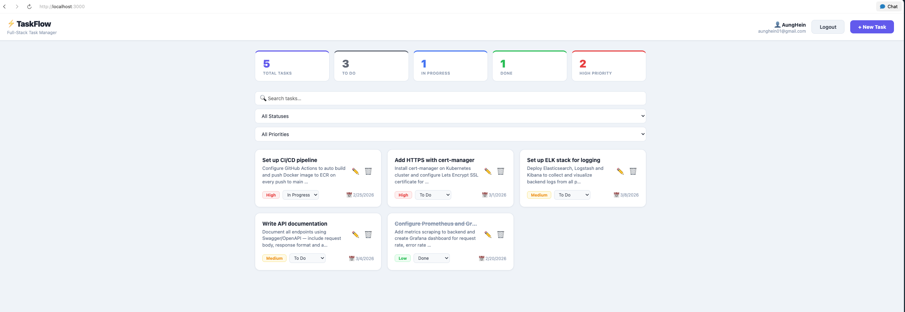

# ⚡ TaskFlow

A full-stack task management application built with React, Node.js, and PostgreSQL — containerized with Docker and deployed to Kubernetes on AWS.

> **Note:** This project was built as a learning exercise. The application code (React, Node.js) was AI-assisted. All Docker and Kubernetes infrastructure was written by me.

## Features

-  User registration and login with JWT authentication
-  Per-user task isolation (users only see their own tasks)
-  Create, update, delete, and filter tasks
-  Task priority levels (low, medium, high)
-  Task status tracking (todo, in progress, done)
-  Due date with overdue detection
