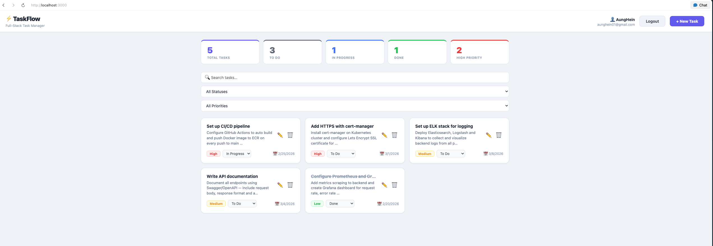
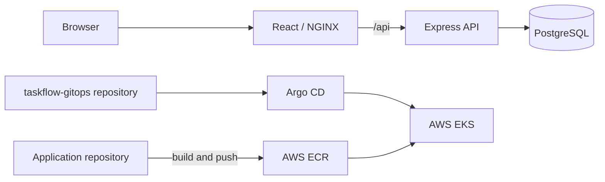

# TaskFlow

TaskFlow is a full-stack task manager with a React frontend, an Express API, and PostgreSQL. This repository contains the application source, Docker images, database schema, deployment guide, and Terraform for the complete AWS platform.



## What lives where

```text
taskflow-todolist-project/
├── backend/                  Express API, authentication, tasks, and SQL schema
├── frontend/                 React/Vite application and production NGINX image
├── infrastructure/terraform AWS infrastructure and cluster platform services
├── DEPLOYMENT_GUIDE.md       Detailed end-to-end AWS deployment runbook
├── helm/                     Older application chart; GitOps uses the other repository
├── k8s/                      Older raw Kubernetes manifests kept for reference
├── docker-compose.yaml       Local PostgreSQL and application containers
└── .env.example              Local environment variable template
```

The active deployment chart is in the separate `taskflow-gitops` repository. Do not update `helm/taskflow` when releasing through Argo CD.

## Architecture


```mermaid
flowchart LR
    Browser --> Frontend[React / NGINX]
    Frontend -->|/api| Backend[Express API]
    Backend --> PostgreSQL[(PostgreSQL)]

    GitHub[Application repository] -->|build and push| ECR[AWS ECR]
    GitOps[taskflow-gitops repository] --> ArgoCD[Argo CD]
    ArgoCD --> EKS[AWS EKS]
    ECR --> EKS
```

## Prerequisites

For local development:

- Node.js 18 or newer and npm
- Docker with Docker Compose
- Git

For AWS deployment, also install:

- AWS CLI v2 with an AWS SSO profile
- Terraform 1.5.7 or newer
- `kubectl` and Helm 3
- Access to the application and GitOps repositories

## Run locally

The reliable development setup runs PostgreSQL and the API in Docker, then runs the React frontend with Vite hot reload.

1. Create your local environment file:

   ```bash
   cd taskflow-todolist-project
   cp .env.example .env
   ```

2. Edit `.env`. At minimum, replace `DB_PASSWORD` and `JWT_SECRET`. Keep `DB_HOST=db` because the backend connects to PostgreSQL through the Compose network.

3. Start PostgreSQL and the backend:

   ```bash
   docker compose up -d --build db backend
   ```

4. Run the frontend:

   ```bash
   cd frontend
   npm ci
   npm run dev
   ```

Open <http://localhost:3000>. The Vite server forwards `/api` to the backend container published at <http://localhost:5001>. Check the API with:

```bash
curl http://localhost:5001/health
```

Follow backend logs with `docker compose logs -f backend`. The schema in `backend/schema.sql` is loaded when the PostgreSQL volume is first created. To recreate an empty local database, run `docker compose down -v` and then repeat the startup steps. This deletes local database data.

### Full Docker Compose stack

`docker compose up --build` builds all three containers and exposes the UI on port 80. The current frontend NGINX configuration targets the Kubernetes backend DNS name, so API calls from the Compose frontend require a Compose-specific proxy configuration. Use the development setup above until that proxy is separated into local and Kubernetes configurations.

## Important environment variables

| Variable | Used by | Purpose |
| --- | --- | --- |
| `PORT` | Backend | API port; default is `5001` |
| `DB_HOST` | Backend | `db` in Compose or the RDS hostname in EKS |
| `DB_PORT` | Backend | PostgreSQL port, normally `5432` |
| `DB_USER` / `DB_PASSWORD` / `DB_NAME` | Backend | Database credentials and database name |
| `DB_SSL` | Backend | Set to `true` for the current RDS deployment |
| `CLIENT_URL` | Backend | Allowed CORS origin |
| `JWT_SECRET` | Backend | Signs login tokens; use a strong secret |
| `VITE_API_TARGET` | Frontend dev server | Backend URL used by Vite's `/api` proxy |

Never commit `.env`, Terraform state, `terraform.tfvars`, database passwords, or JWT secrets. They are ignored by this repository.

## Build container images

Build both production images from the repository root:

```bash
docker build -t taskflow-backend:local backend
docker build -t taskflow-frontend:local frontend
```

The current GitOps values use Docker Hub images. To use the ECR repositories created by Terraform instead, authenticate to ECR, push immutable tags, and update the GitOps image repository values:

```bash
AWS_ACCOUNT_ID=123456789012
AWS_REGION=us-east-1
IMAGE_TAG=$(git rev-parse --short HEAD)

aws ecr get-login-password --region "$AWS_REGION" \
  | docker login --username AWS --password-stdin "$AWS_ACCOUNT_ID.dkr.ecr.$AWS_REGION.amazonaws.com"

docker tag taskflow-backend:local "$AWS_ACCOUNT_ID.dkr.ecr.$AWS_REGION.amazonaws.com/taskflow-backend:$IMAGE_TAG"
docker tag taskflow-frontend:local "$AWS_ACCOUNT_ID.dkr.ecr.$AWS_REGION.amazonaws.com/taskflow-frontend:$IMAGE_TAG"
docker push "$AWS_ACCOUNT_ID.dkr.ecr.$AWS_REGION.amazonaws.com/taskflow-backend:$IMAGE_TAG"
docker push "$AWS_ACCOUNT_ID.dkr.ecr.$AWS_REGION.amazonaws.com/taskflow-frontend:$IMAGE_TAG"
```

With `repositories = ["backend", "frontend"]`, Terraform creates `taskflow-backend` and `taskflow-frontend`. The module adds the project prefix, so do not include `taskflow-` in each list item.

## Build the AWS infrastructure

Terraform creates the VPC and NAT networking, EKS and EBS CSI, ECR repositories, private RDS PostgreSQL, Argo CD, kube-prometheus-stack, Gateway API CRDs, NGINX Gateway Fabric, and the AWS Load Balancer Controller.

Follow [the Terraform guide](infrastructure/terraform/README.md) for AWS SSO login, variable configuration, plan/apply, kubeconfig, validation, and cleanup.

Terraform does not build or push application images, apply the TaskFlow Argo CD `Application`, create Route 53 records, or issue TLS certificates. Follow [the deployment runbook](DEPLOYMENT_GUIDE.md) after the infrastructure apply.

## Deploy through GitOps

The intended release flow is:

1. Change and test code in this repository.
2. Build backend and frontend images and push the same immutable tag to ECR.
3. In `taskflow-gitops/taskflow/values-dev.yaml`, update both image tags.
4. Commit and push the GitOps change to `main`.
5. Argo CD detects the commit and syncs the Helm chart into the `taskflow` namespace.

See the `taskflow-gitops` README for controller prerequisites, first deployment, verification, rollback, and the Helm values reference.

## Where should I make a change?

| Change | File or directory |
| --- | --- |
| API routes, auth, or database access | `backend/` |
| Database tables or indexes | `backend/schema.sql` plus a proper migration for an existing database |
| React pages, components, or API calls | `frontend/src/` |
| Local credentials or ports | `.env` |
| VPC CIDR, region, EKS version, nodes, ECR, or RDS settings | `infrastructure/terraform/terraform.tfvars` |
| AWS resource implementation | `infrastructure/terraform/modules/vpc/` or `modules/eks/` |
| Shared Kubernetes settings | `taskflow-gitops/taskflow/values.yaml` |
| Development replicas or image tags | `taskflow-gitops/taskflow/values-dev.yaml` |
| Production replicas or image tags | `taskflow-gitops/taskflow/values-prod.yaml` |
| Argo CD repository, branch, chart path, or destination | `taskflow-gitops/argocd/taskflow-dev.yaml` |

## Useful checks

```bash
# Application logs
docker compose logs -f db

# Render the deployment before committing GitOps changes
helm lint ../taskflow-gitops/taskflow \
  -f ../taskflow-gitops/taskflow/values.yaml \
  -f ../taskflow-gitops/taskflow/values-dev.yaml

# Cluster status after deployment
kubectl get nodes
kubectl get pods,services -n taskflow
kubectl get applications -n argocd
```

There are currently no automated application tests or CI workflow in this repository. Run the build and Helm/Terraform checks manually until CI is added.
