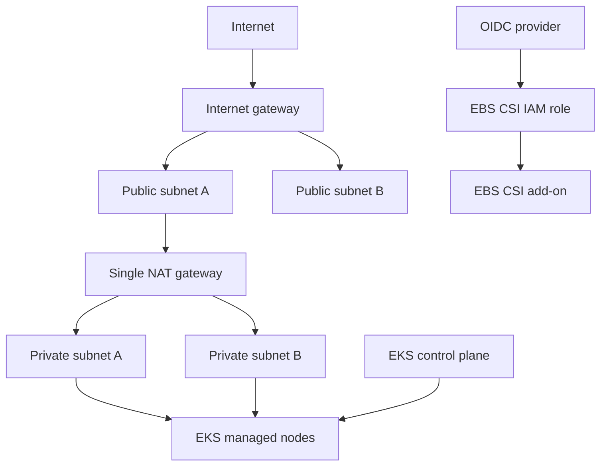

# TaskFlow AWS infrastructure

This Terraform configuration builds the network and EKS foundation used by TaskFlow. The resources are written directly with AWS provider resources so each part is visible and teachable.

## What Terraform creates



The VPC module creates:

- One VPC using `vpc_cidr`
- Two public and two private subnets across the first two available Availability Zones
- One internet gateway
- One Elastic IP and one NAT gateway in the first public subnet
- Public and private route tables
- Kubernetes subnet discovery tags

The EKS module creates:

- EKS control plane and cluster IAM role
- Managed EC2 node group in the private subnets
- Node IAM role with worker, CNI, and ECR read-only policies
- Cluster OIDC provider
- EBS CSI IAM role restricted to its Kubernetes service account
- AWS EBS CSI managed add-on

This configuration does not create ECR repositories, an RDS database, Argo CD, the AWS Load Balancer Controller, NGINX Gateway Fabric, Route 53 records, or TLS certificates.

## Prerequisites

- Terraform 1.5.7 or newer
- AWS CLI v2
- An AWS SSO profile with permission to create VPC, EC2, EKS, IAM, and related resources
- `kubectl`

The examples below use the profile `mhmarkets`; replace it with your profile.

## 1. Configure and verify AWS SSO

Configure a profile once if it does not already exist:

```bash
aws configure sso
```

Start an SSO session and verify the account before Terraform makes changes:

```bash
aws sso login --profile mhmarkets
aws sts get-caller-identity --profile mhmarkets
```

Terraform reads the profile from `aws_profile` in `terraform.tfvars`. Do not put access keys in Terraform files.

## 2. Create the local variable file

```bash
cd taskflow-todolist-project/infrastructure/terraform
cp terraform.tfvars.example terraform.tfvars
```

Edit `terraform.tfvars` for your account and environment:

```hcl
project_name = "taskflow"
environment  = "dev"
aws_region   = "us-east-1"
aws_profile  = "mhmarkets"
vpc_cidr     = "10.20.0.0/16"

cluster_name    = "taskflow-cluster"
cluster_version = "1.33"

node_group_name         = "taskflow-node-group"
node_instance_types     = ["t3.medium"]
node_capacity_type      = "ON_DEMAND"
node_group_desired_size = 1
node_group_min_size     = 1
node_group_max_size     = 2
node_group_disk_size    = 30
```

Choose a VPC CIDR that does not overlap networks that must connect to it. Confirm that `cluster_version` is supported by EKS in `aws_region` before applying. Keep EKS, ECR, and RDS in one region unless cross-region traffic is intentional.

`terraform.tfvars` is ignored because it can contain account-specific data. Commit changes to `terraform.tfvars.example` when adding a new shared variable.

## 3. Initialize and review

```bash
terraform init
terraform fmt -recursive -check
terraform validate
terraform plan -out=taskflow.tfplan
```

Read the plan carefully. A normal first plan includes VPC networking, IAM roles and policies, the EKS control plane, EC2 worker nodes, OIDC, and the EBS CSI add-on. EKS creation commonly takes 15 to 30 minutes.

Do not apply a saved plan after changing variables or after someone else changes the infrastructure; create a fresh plan.

## 4. Apply and connect to EKS

```bash
terraform apply taskflow.tfplan
terraform output
```

Use the generated command from the output:

```bash
terraform output -raw configure_kubeconfig_command
```

Run that command, then verify access:

```bash
kubectl get nodes
kubectl get pods -A
```

Creating the cluster does not automatically grant every SSO role Kubernetes administrator access. If `kubectl` reports an authentication or authorization error, add the SSO IAM role as an EKS access entry and associate the appropriate EKS access policy before continuing.

## Configuration map

| Setting | Where to edit | Effect |
| --- | --- | --- |
| AWS account profile and region | `terraform.tfvars` | Selects the AWS identity and deployment region |
| VPC CIDR | `terraform.tfvars` | Controls all generated subnet CIDRs |
| Subnet count or NAT design | `modules/vpc/main.tf` | Changes network topology and cost/availability |
| Kubernetes version | `terraform.tfvars` | Sets EKS control plane and node version |
| Node instance type and capacity | `terraform.tfvars` | Changes compute cost and available resources |
| Node count and disk size | `terraform.tfvars` | Changes scaling range and node EBS volume size |
| EKS IAM policies or add-ons | `modules/eks/main.tf` | Changes AWS permissions or cluster add-ons |
| Root-to-module wiring | `main.tf` | Passes root variables and module outputs |
| Shared input definitions | `variables.tf` | Defines type, description, and defaults |
| Reusable outputs | `outputs.tf` | Exposes IDs and connection information |

The single NAT gateway is cheaper for development, but it is also one Availability Zone dependency. A production design usually uses one NAT gateway and private route table per Availability Zone.

## State and team use

State is currently local. Files matching `*.tfstate` are ignored and must never be committed because state can contain sensitive values. Before multiple people manage this infrastructure, configure an encrypted remote backend with locking and restricted access.

Only one person or pipeline should apply a given state at a time.

## Troubleshooting

`No valid credential sources found` means the SSO session is missing or expired:

```bash
aws sso login --profile mhmarkets
```

If a node group remains in `CREATING`, get its generated name first and then inspect it:

```bash
aws eks list-nodegroups --cluster-name taskflow-cluster --region us-east-1 --profile mhmarkets
aws eks describe-nodegroup --cluster-name taskflow-cluster --nodegroup-name ACTUAL_NAME --region us-east-1 --profile mhmarkets
```

Also inspect nodes and the EKS add-on:

```bash
kubectl get nodes -o wide
aws eks describe-addon --cluster-name taskflow-cluster --addon-name aws-ebs-csi-driver --region us-east-1 --profile mhmarkets
```

The Terraform resource label `node_group` is not necessarily the final AWS node group name. Always use `aws eks list-nodegroups` to find the actual name.

## Destroy the environment

Destroying removes the cluster, nodes, NAT gateway, and VPC resources managed by this state. Back up application data first; workloads using persistent volumes may need separate cleanup.

```bash
terraform plan -destroy
terraform destroy
```

Review the destroy plan and confirm you are using the correct AWS account, region, profile, workspace, and state before approving it.
